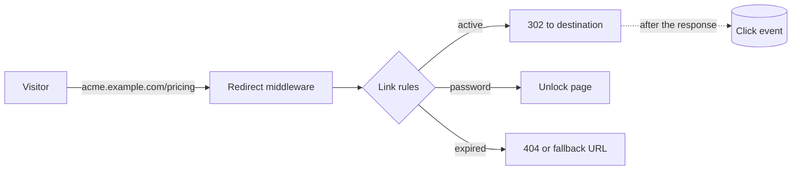

# Introduction

Linkyard turns long URLs into short ones you control, and keeps control after
you have shared them.

That last part is the whole point. A short link is a layer of indirection: the
URL you hand out stops being the URL people land on. Once you have that layer,
you can move the destination, retire a campaign, put a password in front of a
draft, or find out that nobody clicked the link in your newsletter — none of
which is possible when you paste a raw URL into a slide.

## Why not a hosted shortener

Most teams reach for a SaaS shortener and quietly accept three things:

Your links live on someone else's domain, so leaving means breaking every link
you ever shared. Your click data lives in someone else's database, usually with
IP addresses attached. And your pricing scales with the one thing you cannot
control, which is how many people click.

Linkyard runs on your own infrastructure. The links are on your domain, the
analytics are in your Postgres, and the cost is whatever your server costs.

## What it is not

It is not an analytics suite. You get clicks, unique visitors, referrers,
countries, devices, and browsers, with bot traffic separated out. If you need
funnels or session replay, keep your existing tool — Linkyard passes UTM
parameters straight through to it.

It is not a marketing automation platform. Campaigns here are a way to group
links and share UTM values, nothing more.

## How it fits together

The redirect is resolved by server middleware before any Vue code loads. One
cached read, then a `302`. Analytics are written **after** the response goes
out, so recording a click never slows a visitor down.

## Where to go next

<CardGroup :cols="2">

<Card title="Installation" icon="package" to="/guide/installation">

Docker Compose, or from source with Bun and Postgres.

</Card>

<Card title="Your first link" icon="rocket" to="/guide/quickstart">

From an empty database to a working short link.

</Card>

<Card title="Workspaces" icon="building-2" to="/guide/workspaces">

How ownership, isolation, and subdomains work.

</Card>

<Card title="Architecture" icon="network" to="/project/architecture">

The redirect path, the cache, and the tenancy model.

</Card>

</CardGroup>
