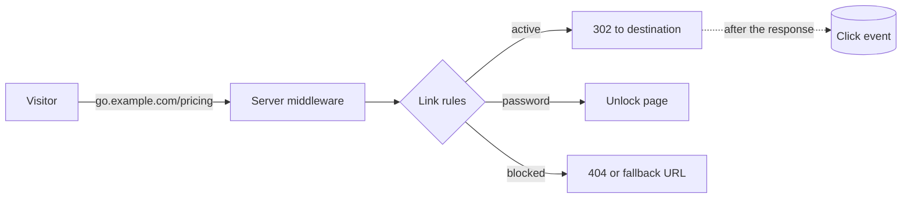

# What is Masir?

Masir is a link manager you run yourself. It turns long URLs into short ones on
your own domain and, more importantly, lets you keep control of those links
after you have shared them.

A short link is a layer between the URL you hand out and the page people land
on. Once that layer exists you can move the destination, retire a campaign,
put a password in front of a draft, or find out that nobody clicked the link in
your newsletter. None of that is possible with a raw URL pasted into a slide.

## Who it is for

Masir is built for teams that share links as part of their work: marketing
teams running campaigns, documentation teams that need stable URLs, agencies
that manage links for several clients, and anyone who prints a QR code and
wants it to keep working.

It fits well if you:

- want links on **your** domain, so leaving a vendor never breaks them
- need more than one person to manage the same set of links
- care about where click data is stored and who can read it
- would rather run one container than pay per click

## Why not a hosted shortener?

Most hosted shorteners ask you to accept three things. Your links live on
someone else's domain, so leaving means breaking every link you ever shared.
Your click data lives in someone else's database, usually with IP addresses
attached. And the price scales with clicks, which is the one number you do not
control.

Masir runs on your infrastructure. The links are on your domain, the analytics
are in your Postgres, and the cost is whatever your server costs.

## What it is not

Masir is not an analytics suite. You get clicks, unique visitors, referrers,
countries, devices, and browsers, with bot traffic separated out. For funnels
or session replay, keep the tool you already use. Masir passes UTM parameters
straight through to it.

It is not a marketing automation platform either. Campaigns here group links
and share UTM values. That is all they do.

## How it works

A redirect is handled by server middleware before any page code loads. One
cached lookup, then a `302`. The click is recorded after the response has been
sent, so analytics never slow a visitor down.

## Where to go next

<CardGroup :cols="2">

<Card title="Installation" icon="package" to="/guide/installation">

Docker Compose in a few minutes, or from source with Bun.

</Card>

<Card title="Your first link" icon="rocket" to="/guide/quickstart">

Create a link, change its destination, and watch the clicks come in.

</Card>

<Card title="Workspaces" icon="building-2" to="/guide/workspaces">

How teams, ownership, and isolation work.

</Card>

<Card title="Features" icon="sparkles" to="/features/">

Everything a link can do, on one page.

</Card>

</CardGroup>
