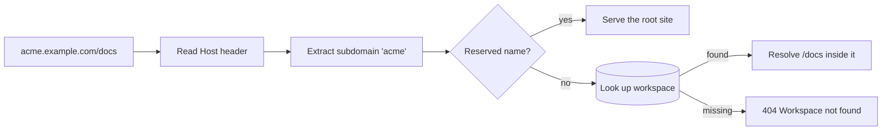

# Multi-workspace mode

Give every workspace its own subdomain behind a single wildcard record. This is
the shape you want if you are running Masir for more than one team.

```text
acme.example.com/pricing     →  Acme's link
apple.example.com/pricing    →  Apple's link, unrelated
```

Both links can use the slug `pricing`. Slugs are unique **within** a workspace,
not globally, so one team claiming a good name never blocks another.

## Turning it on

```sh [.env]
NUXT_MULTI_WORKSPACE=true
NUXT_ROOT_DOMAIN=https://example.com
NUXT_SESSION_COOKIE_DOMAIN=.example.com
```

The third one is not optional, and Masir refuses to boot without it:

```text
Error: NUXT_MULTI_WORKSPACE is true, so NUXT_SESSION_COOKIE_DOMAIN must be set
```

A session cookie scoped to `acme.example.com` does not travel to
`apple.example.com`. Without the parent domain, switching workspaces would ask
people to sign in again every time — a failure that looks like a bug and is
easy to ship unnoticed. Failing at boot is louder and cheaper.

## DNS and certificates

Two records, configured once:

```text
example.com      A      203.0.113.10
*.example.com    A      203.0.113.10
```

And one wildcard certificate covering `*.example.com`.

That is the entire infrastructure cost of the feature. **Creating a workspace
is a database insert.** No Cloudflare API call, no Vercel domain registration,
no per-workspace certificate. A workspace is live the moment its row exists.

## How a request resolves



Unknown subdomains return a workspace-not-found page. Masir never creates a
workspace from a hostname somebody typed.

Reserved subdomains — `www`, `api`, `app`, `admin`, `auth`, `docs`, `mail`,
`cdn`, and others — can never be claimed as workspace slugs, so infrastructure
names stay available.

## The root domain

`example.com` serves marketing, sign-up, sign-in, verification, recovery, and
the workspace selector. It serves **no short links**. Short links exist only
inside a workspace, so every one of them carries its team's subdomain.

## Local development

Multi-workspace mode works locally, but not on `localhost`. Chrome stores a
cookie for `localhost` as host-only and ignores a `Domain=.localhost`
attribute, so a session started on `localhost:3000` never reaches
`acme.localhost:3000` and every workspace asks you to sign in again. Use a
hostname with a dot. `lvh.me` and every name under it resolve to `127.0.0.1`
through public DNS, so nothing needs a hosts-file entry:

```sh [.env]
NUXT_MULTI_WORKSPACE=true
NUXT_ROOT_DOMAIN=http://lvh.me:3000
NUXT_PUBLIC_SHORT_DOMAIN=http://lvh.me:3000
NUXT_SESSION_COOKIE_DOMAIN=.lvh.me
NUXT_SESSION_COOKIE_SECURE=false
```

The last line matters: Chrome accepts a `Secure` cookie from `http://localhost`
but from no other plain-http host, so without it `http://lvh.me` also loops back
to the login page.

Then browse to `http://acme.lvh.me:3000`. Offline, add `lvh.me` and the
workspace names you use to `/etc/hosts` instead.

Neither an IP address nor `localhost` can carry a workspace subdomain, and Masir
refuses to boot if you combine `NUXT_MULTI_WORKSPACE=true` with either in
`NUXT_ROOT_DOMAIN`.

## Switching workspaces

People who belong to several workspaces get a switcher in the sidebar. Selecting
one navigates to its subdomain, carrying the shared session.

After sign-in: one workspace redirects straight there, several show a selector,
and none sends you to workspace creation.
