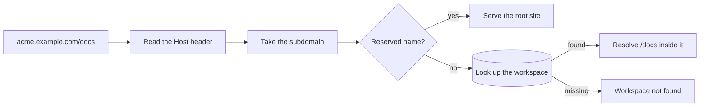

# Multi-workspace mode

Give every workspace its own subdomain behind a single wildcard DNS record.
This is the shape for running Masir for more than one team: an agency with
several clients, a company with independent departments, or a small hosted
service.

```text
acme.example.com/pricing     Acme's link
apple.example.com/pricing    Apple's link, unrelated
```

Both links use the slug `pricing`. Slugs are unique **within** a workspace, not
across the instance, so one team claiming a good name never blocks another.

## Turning it on

```sh [.env]
NUXT_MULTI_WORKSPACE=true
NUXT_ROOT_DOMAIN=https://example.com
NUXT_SESSION_COOKIE_DOMAIN=.example.com
NUXT_ALLOW_REGISTRATION=true
```

The cookie domain is required. Masir refuses to boot without it:

```text
Error: NUXT_MULTI_WORKSPACE is true, so NUXT_SESSION_COOKIE_DOMAIN must be set (for example ".example.com")
```

A session cookie scoped to `acme.example.com` does not travel to
`apple.example.com`. Without the parent domain, switching workspaces would ask
people to sign in again every time, which looks like a bug and is easy to ship
unnoticed. Failing at boot is louder and cheaper.

Registration is usually on in this mode, so people can create their own
workspace. Leave it off if you create every workspace yourself.

## DNS and certificates

Two records, set once:

```text
example.com      A      203.0.113.10
*.example.com    A      203.0.113.10
```

And one certificate that covers `*.example.com`.

That is the entire infrastructure cost of the feature. **Creating a workspace is
a database insert.** No DNS API call, no per-workspace certificate. A workspace
is live the moment its row exists.

## How a request resolves



An unknown subdomain gets a "workspace not found" page. Masir never creates a
workspace from a hostname somebody typed.

Reserved subdomains such as `www`, `api`, `app`, `admin`, `auth`, `docs`,
`mail`, and `cdn` can never be claimed as workspace slugs, so infrastructure
names stay available.

## The root domain

`example.com` itself serves sign-up, sign-in, verification, recovery, and the
workspace picker. It serves **no short links**. Every short link lives inside a
workspace and carries that workspace's subdomain.

## Switching workspaces

People who belong to several workspaces get a switcher in the account menu.
Choosing one navigates to its subdomain and carries the shared session along.

After sign-in, one workspace sends you straight there, several show the picker,
and none sends you to create one.

## Local development

Multi-workspace mode works locally, but not on `localhost`. Browsers store a
cookie for `localhost` as host-only and ignore a `Domain=.localhost` attribute,
so a session started on `localhost:3000` never reaches `acme.localhost:3000`.
Use a hostname with a dot. `lvh.me` and every name under it resolve to
`127.0.0.1` through public DNS, so nothing needs a hosts-file entry:

```sh [.env]
NUXT_MULTI_WORKSPACE=true
NUXT_ROOT_DOMAIN=http://lvh.me:3000
NUXT_PUBLIC_SHORT_DOMAIN=http://lvh.me:3000
NUXT_SESSION_COOKIE_DOMAIN=.lvh.me
NUXT_SESSION_COOKIE_SECURE=false
```

The last line matters. Browsers accept a `Secure` cookie from `http://localhost`
and from no other plain-HTTP host, so without it `http://lvh.me` also loops
back to the login page.

Then browse to `http://acme.lvh.me:3000`. Offline, add `lvh.me` and the
workspace names you use to `/etc/hosts` instead.

Masir refuses to boot when `NUXT_MULTI_WORKSPACE=true` is combined with
`localhost`, an IP address, or a hostname without a dot in `NUXT_ROOT_DOMAIN`.
