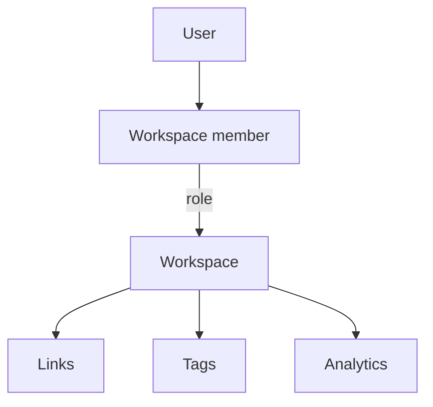

# Workspaces

A workspace owns every link, tag, campaign, and click event. People reach a
workspace through a membership, never directly.

This matters more than it sounds. Links belong to the workspace, so when
somebody leaves the company their links do not leave with them. You remove the
person; the links stay exactly where they were.

## One workspace or many

Linkyard runs in two shapes, decided by a single variable.

| | Self-hosted | Multi-workspace |
|---|---|---|
| `NUXT_MULTI_WORKSPACE` | `false` | `true` |
| Workspaces | One | Many |
| Address | Your own host | One subdomain each |
| Wildcard DNS | Not needed | Required |
| Registration | Closed by default | Open |

In self-hosted mode the server never looks at the hostname. It loads its one
workspace and serves it on whatever host the request arrived on — a domain, a
bare IP, `localhost`. There is nothing to configure and no certificate work
beyond the one you already have.

<ReadMore to="/guide/multi-workspace" title="Run many workspaces on subdomains" />

## Creating one

The seed script creates the first workspace along with the first user, so a
fresh install works immediately.

After that, `POST /api/workspaces` creates a workspace, its owner membership,
and its trial state **in one transaction**. A workspace can never exist without
an owner, because the insert that would leave it ownerless never commits.

In self-hosted mode the second workspace is refused with a `409`. The check runs
on the server, not by hiding a button.

## The address is permanent

A workspace slug becomes part of every short link published from it. You cannot
change it after creation, and the interface says so before you submit.

Slugs are lowercase, use letters, numbers, and hyphens, and run from 3 to 63
characters. A list of reserved names — `www`, `api`, `admin`, `app`, `mail`, and
others — is refused, so nobody can claim a subdomain that infrastructure needs.

The form suggests a slug from the workspace name as you type, but it never
rewrites what you typed yourself. If you enter something invalid you get an
error, not a silent correction.

## Isolation

Every query that touches tenant data carries a workspace. Two workspaces can
hold the same slug, so `acme.example.com/docs` and `apple.example.com/docs` are
different links that never see each other.

When somebody asks for a workspace they do not belong to, the answer is **404,
never 403**. A `403` would confirm that the workspace exists, which tells an
outsider something they should not learn from a URL.

::: tip This is tested, not asserted
`test/e2e/workspace-isolation.test.ts` proves that workspace A cannot read,
edit, or delete workspace B's link by id, that the link survives the attempt,
and that both workspaces can hold the same slug.
:::

## Deletion

Only the owner can delete a workspace, and deletion is soft. The row stays, the
`deleted_at` timestamp is set, and every lookup filters it out — so the
subdomain stops resolving and the links stop working, but nothing is destroyed
if you change your mind.
