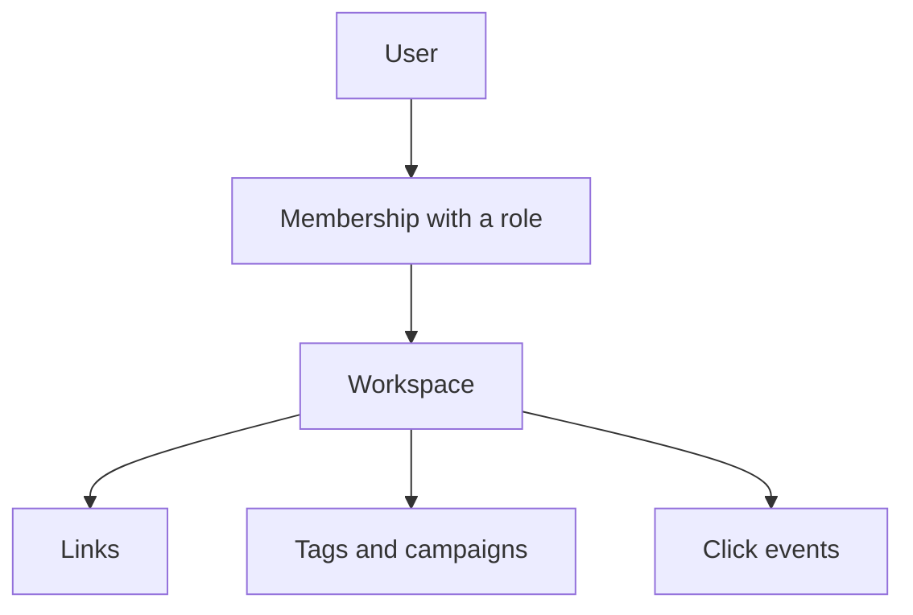

# Workspaces

A workspace is where your team's links live. It owns every link, tag,
campaign, and click event inside it. People reach a workspace through a
membership, never directly.

This matters more than it sounds. Because links belong to the workspace and
not to the person who made them, someone leaving the company does not take
their links with them. You remove the person. The links stay where they were.

## One workspace or many

Masir runs in two shapes. One environment variable decides.

| | Single workspace | Multi-workspace |
|---|---|---|
| `NUXT_MULTI_WORKSPACE` | `false` | `true` |
| Workspaces | One, created by the seed | As many as you like |
| Address | Your own host | One subdomain per workspace |
| Wildcard DNS | Not needed | Required |
| Registration | Closed by default | Usually open |

In single-workspace mode the server does not look at the hostname. It loads its
one workspace and serves it on whatever host the request arrived on: a domain,
a bare IP, or `localhost`. There is nothing to configure.

<ReadMore to="/guide/multi-workspace" title="Run many workspaces on subdomains" />

## Creating a workspace

The seed script creates the first workspace together with the first user, so a
fresh install works right away.

After that, a signed-in user with a verified email can create a workspace from
the workspace picker. The workspace, its owner membership, and its plan state
are written in one transaction, so a workspace can never exist without an
owner.

In single-workspace mode a second workspace is refused with a `409`. The check
runs on the server, not by hiding a button.

## The address is permanent

In multi-workspace mode the workspace slug becomes the subdomain, and the
subdomain is part of every short link published from it. You cannot change it
after creation, and the form says so before you submit.

A slug is 3 to 63 characters of lowercase letters, numbers, and hyphens. It
cannot start or end with a hyphen. A short list of names is reserved for
infrastructure and is refused: `www`, `app`, `api`, `admin`, `auth`, `mail`,
`docs`, `status`, and a few more.

The form suggests a slug from the workspace name as you type, but it never
rewrites what you typed yourself. An invalid value gets an error, not a silent
correction.

## Name and logo

The owner can rename the workspace and upload a logo from
**Settings → Workspace**. PNG, JPEG, GIF, and WebP are accepted, up to 2 MiB by
default. The logo is checked by its bytes, so a renamed file does not get
through.

## Isolation

Every query that touches workspace data carries the workspace id. Two
workspaces can hold the same slug, so `acme.example.com/docs` and
`apple.example.com/docs` are different links that never see each other.

When someone asks for a workspace they do not belong to, the answer is **404,
never 403**. A `403` would confirm that the workspace exists, which is
something an outsider should not learn from a URL.

::: tip Tested, not assumed
The end-to-end suite proves that workspace A cannot read, edit, or delete
workspace B's link by id, that the link survives the attempt, and that both
workspaces can hold the same slug.
:::

## Deleting a workspace

Only the owner can delete a workspace, and the delete is soft. The row stays
with a `deleted_at` timestamp, every lookup filters it out, the subdomain stops
resolving, and the links stop working. Nothing is destroyed, so a mistake can
be undone from the database.

An instance refuses to delete its only workspace.
