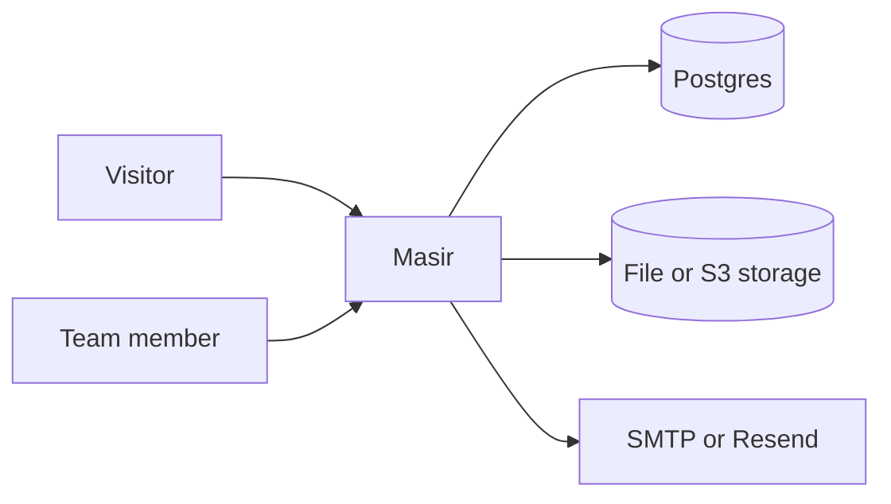

```sh
curl -fsSL https://raw.githubusercontent.com/hamedniroomand/masir/main/scripts/install.sh | sh
```

## Start with your role

<CardGroup :cols="3">

<Card title="I want to try Masir" icon="rocket" to="/guide/">

Choose an install path and create your first short link.

</Card>

<Card title="I use Masir" icon="link" to="/features/">

Manage links, access rules, targeting, analytics, and campaigns.

</Card>

<Card title="I operate Masir" icon="server" to="/guide/self-hosting">

Configure domains, email, storage, backups, monitoring, and upgrades.

</Card>

<Card title="I integrate with Masir" icon="braces" to="/reference/api">

Use the same HTTP API as the Masir interface.

</Card>

<Card title="I contribute to Masir" icon="folder-git-2" to="/project/">

Set up the repository, run its checks, and understand the architecture.

</Card>

<Card title="I need an exact value" icon="settings" to="/reference/">

Look up environment variables, scripts, routes, and the data model.

</Card>

</CardGroup>

## Built for links that must last

<CardGroup :cols="2">

<Card title="Change the destination, not the link" icon="link">

Keep a URL printed on a poster, QR code, email, or document. Update where it
goes without asking people to use a new address.

</Card>

<Card title="Give links to a team" icon="users">

Workspaces keep links with the organization. Owners, members, and viewers get
clear permissions.

</Card>

<Card title="Control when a link works" icon="shield-check">

Add a password, opening date, expiry date, visit limit, or fallback
destination. A visit limit of one creates a one-time link.

</Card>

<Card title="Measure without keeping raw identities" icon="chart-line">

See clicks, daily unique visitors, referrers, countries, devices, browsers,
and bots. Masir stores neither visitor IP addresses nor user-agent strings.

</Card>

</CardGroup>

## One service, two deployment models

Masir runs as one application beside Postgres.

- **Single workspace** is the default. One team uses one domain.
- **Multi-workspace** gives each workspace a subdomain behind wildcard DNS and
  a wildcard certificate.

Docker Compose is the recommended production path. You can also build the
image yourself, run from source, or deploy the Bun server on Vercel.



## Know the current limits

Masir does not include billing, API tokens, two-factor authentication, or a
custom domain for each workspace. The HTTP API uses the same session cookie as
the interface. Analytics cover link traffic, not funnels or session replay.

<ReadMore to="/guide/" title="Choose the right way to start" />

