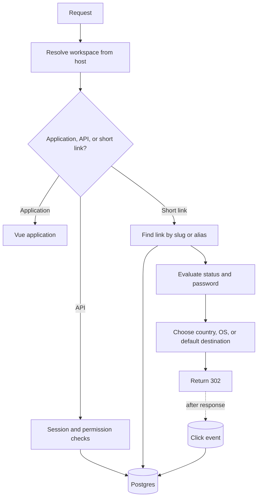

# Architecture

> Masir is one Nitro application, one Postgres database, and optional external providers.

Redis shares rate-limit counters. S3-compatible storage, mail, Sentry, and
Google Analytics are optional.

## Request flow

## Ordered middleware

Nitro loads server middleware by filename.

- `00.workspace.ts` resolves the workspace from the host or selects the
  single workspace.
- `01.redirect.ts` checks whether the request path is a short link and
  applies its redirect rules.
- `02.csrf.ts` checks the Origin of state-changing requests.
- `03.landing.ts` decides whether the root shows the application or public
  landing page.

The numeric prefixes are part of the behavior. Redirect resolution needs a
workspace before it can query a slug.

## Redirect evaluation

The redirect path:

1. reads the workspace-scoped cache
2. queries the primary slug, then an active alias on a miss
3. derives status
4. checks the password grant when required
5. chooses the country, operating-system, or default destination
6. merges generated and incoming query values
7. atomically consumes a successful human visit
8. returns `302`
9. records the event after the response

Bots use the default destination and do not consume visit limits.

## Cache

Each process keeps resolved links in memory for 60 seconds and misses for 15
seconds. Keys include the workspace ID and slug.

Writes invalidate the affected link entries. Several app instances have
separate caches, so a value can remain stale on another instance until its
short lifetime ends.

## Durable state

Postgres stores accounts, workspaces, links, analytics, audit events, and
provider metadata.

The database enforces important invariants such as workspace slug uniqueness
and one owner per workspace.

Migrations run under an advisory lock. Rolling instances wait instead of
applying the same migration twice.

## Process and external state

The process stores:

- the link cache
- provider driver instances
- rate-limit counters when Redis is not configured
- the alert timer on a long-running server

Redis stores shared rate-limit counters when configured.

The browser stores the sealed session cookie and short-lived link password
grants. Masir has no server-side session store.

File or S3-compatible storage holds workspace logos. SMTP or Resend delivers
messages.

## Analytics write path

Masir sends the redirect before it inserts the event. Tests must poll for the
event because the response can arrive first.

The application stores a daily visitor hash, not the raw address or user-agent
string.

## Deployment shapes

The same output runs as a long-lived Bun server or on the Vercel Nitro preset.
Runtime configuration separates staging and production images.

Long-running deployments can use local storage and an in-process alert timer.
Serverless and multi-instance deployments need external storage, shared rate
limits, and an external alert schedule.

`GET /api/health` checks Postgres for a load balancer or uptime monitor.

