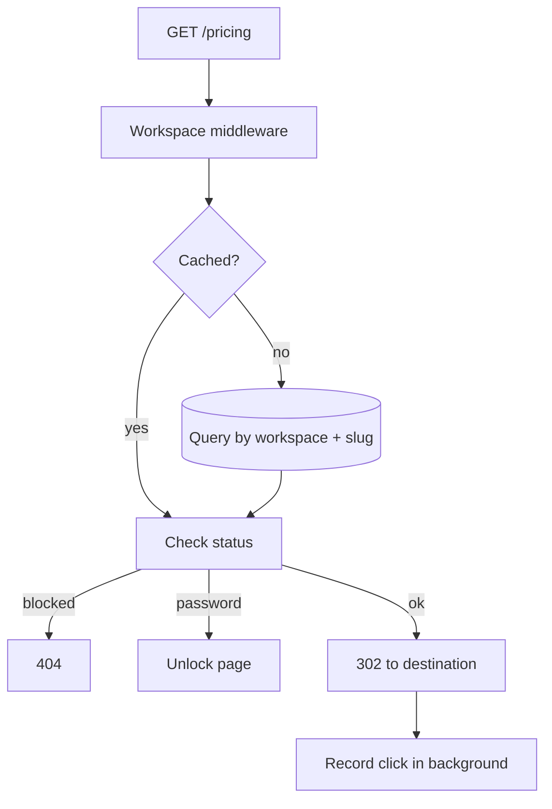

# Architecture

One Nitro process and one Postgres database. Nothing else is required.

## The redirect path

This is the path that has to be fast. Everything else can take its time.



Two pieces of middleware, ordered by filename because Nitro sorts them that
way:

**`00.workspace.ts`** resolves the workspace. In multi-workspace mode it reads
the subdomain from the `Host` header; in self-hosted mode it ignores the host
and uses the single workspace.

**`01.redirect.ts`** resolves the slug within that workspace.

::: info Why the numbers
The files were once `00.redirect.ts` and `00.workspace.ts`. Nitro ordered them
alphabetically, so the redirect ran before the workspace existed and every link
404'd. The numbers are load-bearing.
:::

## The cache

Resolved links are held in memory for 60 seconds, keyed on
`workspaceId + slug`.

The key carries the workspace deliberately. Keyed on slug alone, one workspace's
`pricing` would serve another workspace's destination — a cross-tenant leak from
a cache, which is the kind that does not show up in a test of the query layer.

Consequences worth knowing: an edit can take up to a minute to appear, and
several instances each keep their own copy. For a link shortener that is an
acceptable trade. If it is not acceptable for you, the window is one constant.

## Analytics are written after the response

The redirect is sent, then `event.waitUntil` records the click.

A visitor never waits on an insert. A database that is briefly slow delays
nothing that a person can see.

The cost is a race that tests have to respect: a test asserting on a click must
poll for it, because the response arrives first.

## Where state lives

**Postgres** holds everything durable.

**The process** holds the link cache and the rate-limit counters.

**The visitor's browser** holds the session cookie and, on a protected link, a
15-minute unlock cookie.

There is no Redis, no session store, and no queue. Sessions are sealed JSON
cookies, which is why sign-in scales without a shared store — and why revocation
needs the `session_version` column rather than deleting a row.

## Multi-instance

The cache is fine to duplicate. **The rate limiter is not.** Three instances
means each limit is three times looser than configured, because each process
counts alone.

The counters sit behind a store interface for exactly this reason. Until a
shared driver is wired in, run one instance.

## Deployment shape

A single container.

```text
bun .output/server/index.mjs
```

Migrations run on boot. Configuration is read at runtime, so one image serves
staging and production. `GET /api/health` checks the database and answers 503
when it is unreachable, which is what a load balancer should watch.
