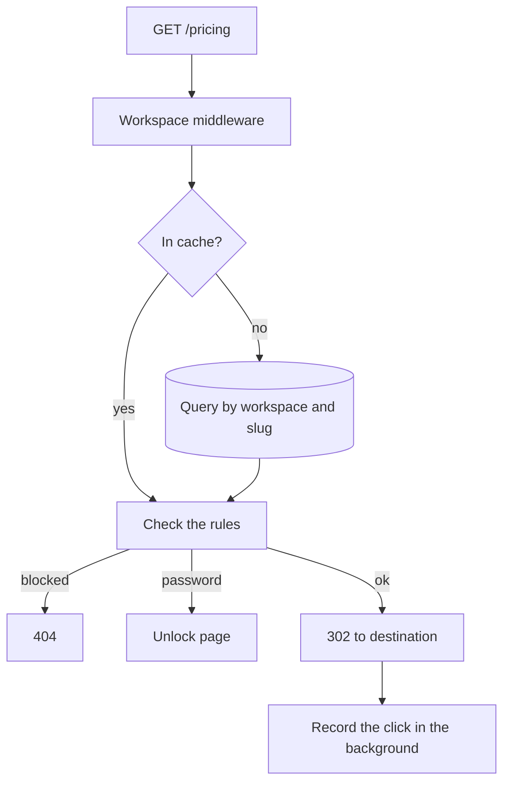

# Architecture

One Nitro process and one Postgres database. Redis is optional and only shares
rate-limit counters between instances.

## The redirect path

This is the path that has to be fast. Everything else can take its time.



Two pieces of server middleware, ordered by filename because Nitro sorts them
that way:

- **`00.workspace.ts`** resolves the workspace. In multi-workspace mode it
  reads the subdomain from the `Host` header. In single-workspace mode it
  ignores the host and loads the one workspace.
- **`01.redirect.ts`** resolves the slug inside that workspace and applies the
  link's rules.

A third, `02.csrf.ts`, rejects a state-changing request whose `Origin` does not
match the `Host`.

::: info Why the numbers
The files were once `00.redirect.ts` and `00.workspace.ts`. Nitro ordered them
alphabetically, so the redirect ran before the workspace existed and every link
answered 404. The numbers are load-bearing.
:::

The application pages render on the client only. The server renders the
visitor-facing error page behind a short link itself, so link previews and
crawlers read it without JavaScript.

## The cache

Resolved links are held in memory for 60 seconds, keyed on the workspace id
plus the slug. A miss is held for 15 seconds. Creating, updating, or deleting a
link clears its entry.

The key carries the workspace on purpose. Keyed on the slug alone, one
workspace's `pricing` would serve another workspace's destination, a
cross-tenant leak from a cache that no test of the query layer would catch.

With several instances each keeps its own copy, so an edit can take up to a
minute to appear everywhere. For a link shortener that is an acceptable trade.

## Analytics are written after the response

The redirect is sent, then `event.waitUntil` records the click. A visitor never
waits on an insert, and a database that is briefly slow delays nothing a person
can see.

The cost is a race that tests have to respect: a test asserting on a click must
poll for it, because the response arrives first.

## Where state lives

**Postgres** holds everything durable.

**The process** holds the link cache and, without Redis, the rate-limit
counters.

**Redis**, when `NUXT_REDIS_URL` is set, holds the rate-limit counters so
several instances share them.

**The visitor's browser** holds the session cookie and, on a protected link, a
15-minute unlock cookie.

There is no session store and no queue. Sessions are sealed JSON cookies, which
is why sign-in scales without shared state, and why revocation needs the
`session_version` column instead of deleting a row.

## Running several instances

The cache is fine to duplicate. The rate limiter is not: without a shared store,
three instances make each limit three times looser than configured. Set
`NUXT_REDIS_URL` before you scale out.

Migrations run on boot under a Postgres advisory lock, so a rolling deploy
applies them once while the other instances wait.

## Deployment shape

A single container:

```text
bun .output/server/index.mjs
```

Configuration is read at runtime, so one image serves staging and production.
`GET /api/health` checks the database and answers `503` when it is unreachable,
which is what a load balancer should watch.

The `db:migrate` and `db:seed:admin` scripts ship in the image as bundles, so an
operator can run them inside the container without the source tree.
