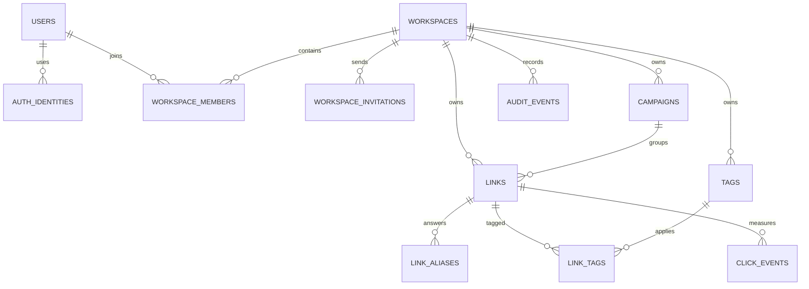

# Data model

> One Postgres database holds accounts, workspaces, links, and event data.

Masir requires Postgres 18 because primary keys use the native `uuidv7()`
function. Drizzle defines the schema and generates forward-only migrations.

## Relationship map



## Tables

| Table | Purpose |
|---|---|
| `users` | Account identity, verification, and session version |
| `auth_identities` | Password, Google, and Microsoft sign-in methods |
| `user_tokens` | Single-use verification and password-reset tokens |
| `workspaces` | Tenant name, slug, plan, link prefix, logo, and state |
| `workspace_members` | User role and active state inside a workspace |
| `workspace_invitations` | Open, accepted, and revoked invitations |
| `campaigns` | Shared campaign and medium values |
| `links` | Destination, slug, access rules, targeting, counters, and state |
| `link_imports` | CSV import batches keyed by workspace and file hash |
| `link_aliases` | Current and revoked extra slugs |
| `tags` | Workspace tag names |
| `link_tags` | Link-to-tag relationships |
| `hosts` | Deduplicated referrer host names |
| `click_events` | Partitioned redirect events |
| `link_daily_stats` | Reserved daily aggregate shape |
| `audit_events` | Product and security change history |
| `mail_outbox` | Database-backed mail outbox shape |

## Tenant boundary

User-reachable product rows carry a workspace ID. Repository operations accept
the workspace as input before they accept a row ID. This prevents a valid row
ID from crossing a workspace boundary.

Click events keep workspace and link IDs without foreign keys. An event log
must not block or cascade a product deletion.

## Identity and sessions

`users.session_version` lets the server invalidate every sealed cookie for an
account. Password reset increments the value.

Password hashes live on `auth_identities`, not on the user row. One user can
connect several providers. The last identity cannot be removed.

`user_tokens` stores SHA-256 hashes for email verification and password
reset. Expired rows are removed during database preparation.

## Workspace constraints

`workspace_members` uses `(workspace_id, user_id)` as its primary key.
A partial unique index permits one owner per workspace.

Only one open invitation can exist for one workspace and email pair.

## Links

Important columns include:

| Column | Meaning |
|---|---|
| `slug` | Public address, unique in the workspace |
| `destination_url` | Current HTTP or HTTPS destination |
| `is_enabled` | Immediate off switch |
| `starts_at`, `expires_at` | Availability window |
| `scheduled_destination` | Fallback before opening |
| `expiration_destination` | Fallback after expiry |
| `limit_destination` | Fallback after the visit cap |
| `password_hash` | Optional Argon2id hash |
| `maximum_visits` | Optional successful-human-visit cap |
| `click_count` | Atomic successful human redirect count |
| `targeting` | Country and operating-system destinations |
| `notes` | Private workspace text |
| `utm_medium` | Optional link-level medium that overrides the campaign value |
| `import_id`, `import_row` | Optional CSV import identity; unique together |
| `deleted_at` | Soft-delete marker |

Status is derived at read time. A scheduled link becomes active without a job.

Deleted links keep their slug. This stops an old public address from later
pointing to a different link.

## Aliases

`link_aliases` uses `(workspace_id, slug)` as its primary key. A revoked
alias remains reserved. A link can have 10 active aliases.

Resolution checks the primary slug, then an active alias.

## Campaigns and tags

A link can belong to one campaign and many tags.

A database check prevents a campaign link from also setting its own
`utm_campaign`. The campaign remains the single source for that value.

## Click events

One event records the request outcome, daily visitor hash, referrer host,
country, device, browser, bot class, and time.

Columns include:

| Column | Meaning |
|---|---|
| `workspace_id`, `link_id` | Scoping IDs without foreign keys |
| `campaign_id` | Effective campaign ID snapshot |
| `outcome` | Smallint numeric outcome code |
| `device`, `browser` | Integer classification codes |
| `bot_category`, `is_bot` | Bot detection attributes |
| `country` | Two-letter ISO country code |
| `referrer_host` | Foreign key to `hosts.id` |
| `visitor_hash` | Daily salted visitor hash |
| `attribution_version` | Attribution format version (1 for current attribution, null on blocks or legacy events) |
| `utm_source` | Effective UTM source snapshot (at most 120 characters) |
| `utm_medium` | Effective UTM medium snapshot (at most 120 characters) |
| `utm_campaign` | Effective UTM campaign snapshot (at most 120 characters) |
| `utm_content` | Effective UTM content snapshot (at most 120 characters) |

It does not store a raw IP address or full user-agent string. It does not record `utm_term` or other query values.

The visitor hash is a salted daily `bigint`. It supports daily unique counts
for one link and cannot join a visitor across days.

Events use monthly range partitions. Database preparation creates the current
month and the next two. A daily job repeats this, so a long-running instance
always has a partition ready. Retention can drop a partition instead of
deleting rows one at a time.

## Audit events

Audit rows contain a type, optional actor, optional workspace and link, JSON
detail, and time.

Events without a workspace, such as sign-in failures and abuse reports, do not
appear in a workspace activity feed.

## Migrations

Migrations live under `drizzle/`. Generate and inspect them after a schema
change:

```sh
bun run db:generate
bun run db:migrate
```

At boot, Masir applies pending migrations under an advisory lock, prepares
click partitions, and removes expired tokens.

