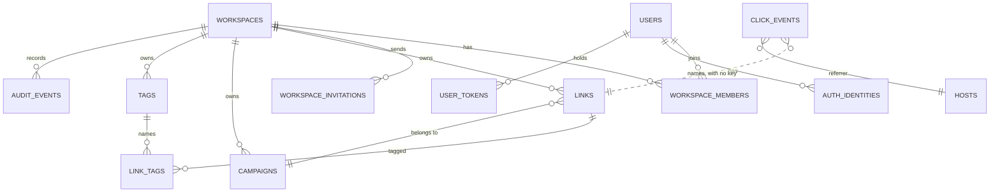

# Data model

Postgres 18, through Drizzle ORM. One database holds everything. The minimum is
18 because every primary key defaults to the native `uuidv7()`.

## The shape



Every table a user can reach carries `workspace_id`. Not for convenience — it is
how isolation is enforced. A query that forgets it returns another workspace's
rows, so the column is `NOT NULL` everywhere and every repository function takes
a workspace as its first argument.

`click_events` is the one exception, and on purpose. See below.

## Column type rules

Every column follows one of these rules. A reviewer checks a new column against
this list, not against taste.

| Rule | Choice | Reason |
|---|---|---|
| Id of an API-visible entity | `uuid`, default `uuidv7()` | 16 bytes. Not enumerable. Time-ordered inserts. |
| Id of an internal event row | `bigint generated always as identity` | 8 bytes. Nobody addresses these rows by id. |
| Categorical column on a cold table | Postgres `enum` | 4 bytes. A human reads the label in psql. |
| Categorical column on the hot table | `smallint` code | 2 bytes. A new code is one line in `shared/codes.ts`. |
| Hash that the app compares | `bytea` | 32 bytes, not 64 hex characters. |
| Hash that the app only counts | `bigint` | First 8 bytes of the digest. Fastest `count(distinct)`. |
| Repeated string on the hot table | `integer` key into a dimension table | 4 bytes for each row instead of the string. |
| Counter | `bigint` | Never overflows. The cost is nothing on a small table. |
| Time | `timestamptz`, default `now()` | Partitioning and `date_trunc` understand it. One clock. |
| Structured detail | `jsonb` | Validates on write. Indexable. |
| Case rule | `check (col = lower(col))` | No `citext`. No extension. Free on read. |
| Encoded password | `text` | Argon2 output carries its own parameters. |

The enum labels are lowercase: `auth_provider`, `token_purpose`,
`workspace_plan`, `member_role`. The API keeps its uppercase strings (`OWNER`,
`PASSWORD`, `TRIAL`). `shared/permissions.ts` owns the role and plan maps, and
`server/utils/identity-repo.ts` owns the provider map. Nothing else translates.

`shared/codes.ts` is the single source for every `smallint` column on
`click_events`: outcome, device, browser, and bot category. Each map has a
reverse lookup. The API answers with labels, never with codes. A code is never
reused after its label is removed.

## Tenancy constraints

Four constraints carry the model. Each replaces application logic that would
otherwise have a race.

**Slugs are unique per workspace.**

```sql
create unique index links_workspace_slug_unique_idx on links (workspace_id, slug);
```

Two teams both own `pricing`. Two simultaneous creates of the same slug in one
workspace: one wins, the other gets a `23505` that becomes a 409.

**One owner per workspace**, as a partial unique index:

```sql
create unique index workspace_members_one_owner_idx
  on workspace_members (workspace_id) where role = 'owner';
```

Transferring ownership is one transaction that demotes and promotes. The index
makes a two-owner state unrepresentable rather than merely unlikely.

**One open invitation for each address in a workspace:**

```sql
create unique index workspace_invitations_open_idx
  on workspace_invitations (workspace_id, email)
  where accepted_at is null and revoked_at is null;
```

A second invitation to the same address answers 409 while the first is open, and
succeeds after a revoke.

**A campaign owns `utm_campaign`:**

```sql
check (campaign_id is null or utm_campaign is null)
```

A link with a campaign carries no `utm_campaign` of its own, so the two can
never disagree.

## Members

`workspace_members` has no surrogate id. Its primary key is
`(workspace_id, user_id)`, and the member routes address a member by user id.

## Users, sessions, and tokens

`users` holds the account and `session_version`. The Argon2id hash lives on the
`password` row in `auth_identities`.

Sessions are sealed cookies with no server-side store, which makes them fast and
makes revocation impossible — unless you version them. Every session carries the
version it was issued at. Bumping the column on the user invalidates every
session that person holds, everywhere, on the next request.

A password reset bumps it. So does removal from a workspace.

`auth_identities` holds one row per provider link, unique on
`(provider, provider_account_id)`. Signing in with Google as an address that
already has a password attaches the identity to that account rather than
creating a second one.

`user_tokens` holds every single-use token. One table, one `purpose` column
(`email_verify` or `password_reset`), one module. `token_hash` is `bytea`, the
raw SHA-256 digest, not its hex text. Boot deletes the expired rows.

## Links

The columns that carry behaviour:

| Column | Purpose |
|---|---|
| `slug` | Unique within the workspace, alive or deleted |
| `destination_url` | Editable after sharing |
| `destination_host` | Extracted at write time, for lookups |
| `is_enabled` | Off switch |
| `starts_at` / `expires_at` | Schedule window |
| `expiration_destination` | Where an expired link goes instead of 404 |
| `password_hash` | Argon2id, null for a public link |
| `maximum_visits` | Cap on successful redirects |
| `click_count` | One counter, raised atomically, only on success |
| `deleted_at` | Soft delete |

Status is derived on read, never stored. A scheduled link becomes active the
moment its start time passes, with no job involved.

**One counter.** `click_count` totals the successful human redirects and it is
also the number the visit limit compares against. The API still answers with
both `clickCount` and `successfulVisitCount`, read from that one column.

**Soft delete.** `deleted_at` replaces the old reserved slug table. The unique
index on `(workspace_id, slug)` has no partial clause, so a deleted row keeps
holding its slug and nobody can take it by accident. The click history survives
the delete, and every read filters `deleted_at is null`.

## Click events

One row per request, with no IP address and no user agent string. `visitor_hash`
is a salted daily digest, so a visitor counts once per day for each link and the
values cannot be joined across days. It is a `bigint`, the first eight bytes of
the digest, because the column is only ever counted, never compared to anything.

`referrer_host` is an `integer` key into `hosts`. A few hundred host names repeat
across millions of rows, so the string is stored once. The server keeps a
`host -> id` map in memory.

Columns are ordered by alignment: 8 bytes, then 4, 2, 1, then variable. Postgres
pads to alignment, and this order saves up to 7 bytes for each row. A stored row
measures 87 to 93 bytes.

**No foreign key to `links` or `workspaces`.** An event log must never block or
cascade a delete. The rows of a deleted link age out with their partition.

**Two indexes, not three:**

```sql
create index click_events_link_created_idx      on click_events (link_id, created_at);
create index click_events_workspace_created_idx on click_events (workspace_id, created_at);
```

Every analytics query scopes by link and time first, and the `outcome` filter
then runs over that small range, so a third index on `outcome` earns nothing.
The workspace index has no reader today. It stays because a workspace dashboard
is the next feature, and the index is cheap to carry from day one and expensive
to build later.

**Monthly partitions.** `click_events` is partitioned by range on `created_at`.
Boot creates the partition for the current month and the next one, on every
start. Retention is `drop table`, never `delete`.

`link_daily_stats` is in the schema and has no reader yet. It ships with the
first release so the hourly rollup can land as a minor later without a schema
change.

## Audit events

`audit_events` records what happened: who created a link, who changed a member,
which sign-in failed. `type` stays `text`, because about 30 labels grow over
time and an enum would need an `alter type` for each new one. `detail` is
`jsonb`, so a reader indexes it instead of parsing it.

A row with no `workspace_id` belongs to no tenant. Sign-in failures and OAuth
errors sit there, and the workspace views filter on a concrete workspace, so
they never reach one.

## Migrations

SQL files under `drizzle/`, generated by `db:generate` and applied by
`db:migrate`. They run at boot as well, so a deploy applies them.

They are incremental and forward-only. There is no down migration — restoring a
backup is the honest rollback, and a `down` that has never been tested is worse
than none.

Boot does three things under one advisory lock, in order: migrate, make the
click event partitions, delete the expired tokens.
