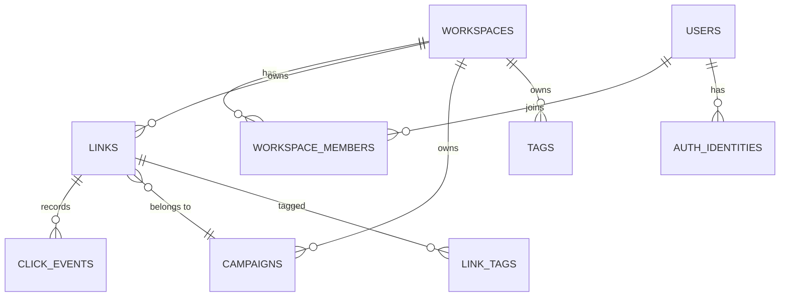

# Data model

Postgres, through Drizzle ORM. One database holds everything.

## The shape



Every table a user can reach carries `workspace_id`. Not for convenience — it is
how isolation is enforced. A query that forgets it returns another workspace's
rows, so the column is `NOT NULL` everywhere and every repository function takes
a workspace as its first argument.

## Tenancy constraints

Three constraints carry the model. Each replaces application logic that would
otherwise have a race.

**Slugs are unique per workspace.**

```sql
create unique index links_workspace_slug_unique_idx on links (workspace_id, slug);
```

Two teams both own `pricing`. Two simultaneous creates of the same slug in one
workspace: one wins, the other gets a `23505` that becomes a 409.

**One owner per workspace**, as a partial unique index:

```sql
create unique index workspace_members_single_owner_idx
  on workspace_members (workspace_id) where role = 'OWNER';
```

Transferring ownership is one transaction that demotes and promotes. The index
makes a two-owner state unrepresentable rather than merely unlikely.

**Released slugs are reserved per workspace**, keyed on
`(workspace_id, slug)`. Deleting a link blocks that slug in that workspace and
nowhere else.

## Users and sessions

`users` holds the account, an Argon2id hash, and `session_version`.

Sessions are sealed cookies with no server-side store, which makes them fast and
makes revocation impossible — unless you version them. Every session carries the
version it was issued at. Bumping the column on the user invalidates every
session that person holds, everywhere, on the next request.

A password reset bumps it. So does removal from a workspace.

`auth_identities` holds one row per provider link, unique on
`(provider, provider_account_id)`. Signing in with Google as an address that
already has a password attaches the identity to that account rather than
creating a second one.

## Links

The columns that carry behaviour:

| Column | Purpose |
|---|---|
| `slug` | Unique within the workspace |
| `destination_url` | Editable after sharing |
| `destination_host` | Extracted at write time, for lookups |
| `is_enabled` | Off switch |
| `starts_at` / `expires_at` | Schedule window |
| `expiration_destination` | Where an expired link goes instead of 404 |
| `password_hash` | Argon2id, null for a public link |
| `maximum_visits` | Cap on successful redirects |
| `successful_visit_count` | Incremented atomically, only on success |

Status is derived on read, never stored. A scheduled link becomes active the
moment its start time passes, with no job involved.

## Click events

One row per request, with no IP address and no user agent string. `visitor_hash`
is a salted daily digest, so a visitor counts once per day per link and the
values cannot be joined across days.

Three indexes cover the queries the dashboard runs: by link and time, by link
and outcome and time, and by workspace and time.

## Migrations

SQL files under `server/database/migrations/`, generated by `db:generate` and
applied by `db:migrate`. They run at boot as well, so a deploy applies them.

They are incremental and forward-only. There is no down migration — restoring a
backup is the honest rollback, and a `down` that has never been tested is worse
than none.
