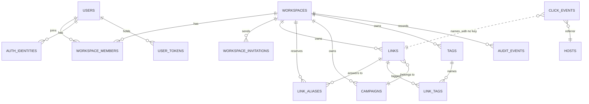

# Data model

One Postgres database holds everything. Masir talks to it through Drizzle ORM.
The minimum is Postgres 18, because every primary key defaults to the native
`uuidv7()` function.

## The shape



Every table a user can reach carries `workspace_id`. This is how isolation is
enforced. A query that forgets it would return another workspace's rows, so
the column is `NOT NULL` everywhere and every repository function takes a
workspace as its first argument.

`click_events` is the one exception, on purpose. See below.

## Column type rules

Every column follows one of these rules, so a new column is checked against a
list rather than against taste.

| Rule | Choice | Reason |
|---|---|---|
| Id of an API-visible row | `uuid`, default `uuidv7()` | 16 bytes. Not enumerable. Time-ordered inserts |
| Id of an internal event row | `bigint generated always as identity` | 8 bytes. Nobody addresses these rows by id |
| Category on a cold table | Postgres `enum` | 4 bytes. Readable in psql |
| Category on the hot table | `smallint` code | 2 bytes. A new code is one line in `shared/codes.ts` |
| Hash the app compares | `bytea` | 32 bytes, not 64 hex characters |
| Hash the app only counts | `bigint` | First 8 bytes of the digest. Fastest `count(distinct)` |
| Repeated string on the hot table | `integer` key into a dimension table | 4 bytes per row instead of the string |
| Counter | `bigint` | Never overflows |
| Time | `timestamptz`, default `now()` | Partitioning and `date_trunc` understand it |
| Structured detail | `jsonb` | Validated on write. Indexable |
| Case rule | `check (col = lower(col))` | No `citext`, no extension |
| Encoded password | `text` | Argon2 output carries its own parameters |

Enum labels are lowercase in the database (`owner`, `password`, `active`). The
API keeps its uppercase strings (`OWNER`, `PASSWORD`, `ACTIVE`). Two small maps
in `shared/permissions.ts` and the identity repository are the only places the
two spellings meet.

`shared/codes.ts` is the single source for every `smallint` column on
`click_events`: outcome, device, browser, and bot category. The API answers with
labels, never with codes, and a code is never reused after its label is
removed.

## Constraints that carry the model

Four constraints replace application logic that would otherwise have a race.

**Slugs are unique per workspace.**

```sql
create unique index links_workspace_slug_unique_idx on links (workspace_id, slug);
```

Two teams both own `pricing`. Two simultaneous creates of the same slug in one
workspace: one wins, the other gets a `23505` that becomes a `409`.

**One owner per workspace**, as a partial unique index:

```sql
create unique index workspace_members_one_owner_idx
  on workspace_members (workspace_id) where role = 'owner';
```

A two-owner state cannot be represented, so ownership transfer is one
transaction that demotes and promotes.

**One open invitation per address per workspace:**

```sql
create unique index workspace_invitations_open_idx
  on workspace_invitations (workspace_id, email)
  where accepted_at is null and revoked_at is null;
```

**A campaign owns `utm_campaign`:**

```sql
check (campaign_id is null or utm_campaign is null)
```

A link with a campaign carries no `utm_campaign` of its own, so the two can
never disagree.

## Users, sessions, and tokens

`users` holds the account and its `session_version`. The argon2id hash lives on
the `password` row in `auth_identities`, never on the user row.

Sessions are sealed cookies with no server-side store. That makes them fast and
makes revocation impossible, unless you version them. Every session carries the
version it was issued at. Bumping the column on the user invalidates every
session that person holds, on the next request. A password reset bumps it.

`auth_identities` holds one row per provider link, unique on
`(provider, provider_account_id)`. Signing in with Google as an address that
already has a password account attaches the identity to that account.

`user_tokens` holds every single-use token. One table, one `purpose` column
(`email_verify` or `password_reset`), one module. `token_hash` is `bytea`, the
raw SHA-256 digest. Boot deletes the expired rows.

## Members

`workspace_members` has no surrogate id. Its primary key is
`(workspace_id, user_id)`, and the member routes address a member by user id.

`member_role` holds `owner`, `member`, and `viewer`. `workspace_invitations`
carries a nullable `role`, and `null` joins as a member, which keeps every
invitation made before the column working.

## Links

The columns that carry behaviour:

| Column | Purpose |
|---|---|
| `slug` | Unique within the workspace, alive or deleted |
| `destination_url` | Editable after sharing |
| `destination_host` | Extracted at write time, for lookups |
| `is_enabled` | The off switch |
| `starts_at`, `expires_at` | Schedule window |
| `expiration_destination` | Where an expired link goes instead of 404 |
| `limit_destination` | Where a used-up link goes instead of 404 |
| `scheduled_destination` | Where a link that has not started goes instead of 404 |
| `password_hash` | argon2id, `null` for a public link |
| `maximum_visits` | Cap on successful redirects |
| `click_count` | One counter, raised atomically, only on success |
| `targeting` | `jsonb`. Per-OS and per-country destinations, `null` when empty |
| `notes` | Private text for the workspace, never sent to a visitor |
| `cap_alert_sent_at`, `expiry_alert_sent_at` | Claim stamps, so each alert mails once |
| `deleted_at` | Soft delete |

Status is derived on read, never stored, so a scheduled link becomes active the
moment its start time passes with no job involved.

**One counter.** `click_count` totals the successful human redirects and is
also the number the visit limit compares against. The API answers with both
`clickCount` and `successfulVisitCount`, read from that one column.

**Soft delete.** The unique index on `(workspace_id, slug)` has no partial
clause, so a deleted row keeps holding its slug. The click history survives,
and every read filters `deleted_at is null`.

## Link aliases

`link_aliases` gives one link several addresses. Its primary key is
`(workspace_id, slug)`, so an alias and a link slug can never collide inside a
workspace.

| Column | Purpose |
|---|---|
| `workspace_id`, `slug` | The address, unique in the workspace |
| `link_id` | The link it reaches |
| `revoked_at` | Set when somebody removes the address |

A **revoked** row stops resolving but stays in the table. So does the alias of a
deleted link, and so does the old address of a rename made with
`keepOldSlug: false`. An address that ever worked never returns to the pool,
because a printed QR code must never start pointing at somebody else's
destination.

`isSlugTaken` reads reserved names, every `links.slug` including deleted rows,
and every alias row whatever its `revoked_at`. A link holds at most 10 live
aliases.

Resolution tries `links.slug` first and falls back to the alias join only on a
miss, so an alias costs one extra query on a cold cache and nothing after that.

## Click events

One row per request, with no IP address and no user agent string.

`visitor_hash` is a salted daily digest stored as a `bigint`, the first eight
bytes of the hash. A visitor counts once per day per link, and values cannot be
joined across days.

`referrer_host` is an `integer` key into `hosts`. A few hundred host names
repeat across millions of rows, so the string is stored once and the server
keeps a `host → id` map in memory.

Columns are ordered by alignment, 8 bytes, then 4, 2, 1, then variable, which
saves up to 7 bytes of padding per row. A row measures 96 bytes with every
column set and 102 at its widest.

**No foreign key to `links` or `workspaces`.** An event log must never block or
cascade a delete. The rows of a deleted link age out with their partition.

**Two indexes:**

```sql
create index click_events_link_created_idx      on click_events (link_id, created_at);
create index click_events_workspace_created_idx on click_events (workspace_id, created_at);
```

Every analytics query scopes by link and time first, so an index on `outcome`
would earn nothing. The workspace index has no reader yet. It is cheap to carry
from day one and expensive to build later, and a workspace dashboard is the
obvious next feature.

**Monthly partitions.** `click_events` is partitioned by range on `created_at`.
Boot creates the partition for the current month and the next one. Retention is
`drop table`, never `delete`.

`link_daily_stats` is in the schema with no reader yet, so an hourly rollup can
land later without a schema change.

## Audit events

`audit_events` records what happened: who created a link, who changed a member,
which sign-in failed, which link was reported. `type` is `text`, because around
30 labels grow over time and an enum would need an `alter type` for each new
one. `detail` is `jsonb`.

A row with no `workspace_id` belongs to no tenant. Sign-in failures, OAuth
errors, and abuse reports sit there, and the workspace views filter on a
concrete workspace, so they never reach one.

## Migrations

SQL files under `drizzle/`, generated by `db:generate` and applied by
`db:migrate`. They also run at boot.

They are incremental and forward-only. There is no down migration. Restoring a
backup is the honest rollback, and a `down` that has never been tested is worse
than none.

Boot does three things under one advisory lock, in order: migrate, create the
click event partitions, delete the expired tokens.
